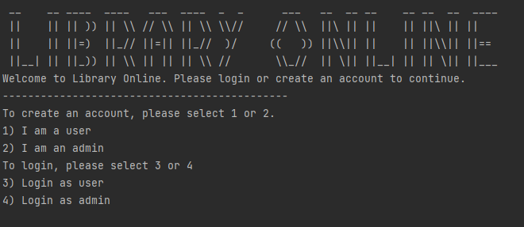

# Java Library

---

## Table of Contents
- [Brief](#brief)
- [About](#about)
- [Screenshots](#screenshots)
- [Languages](#languages)
- [Code of Note](#code_of_note)

---

## Brief 

1. A functioning library system which allows a user to loan and return books
2. Parse a provided csv format book file into a json format file
3. a library admin should be able to run a report on all books out on loan

---

## About 

A java-based library back-end system. Using the console, a user is able to make an account as a user or an admin and run commands linked to the role they signed in as. You are also able to log in as an existing user or admin. An admin can view a list of all users, run a report of all books that are currently on loan. A user can loan and return books, and also search a catalogue of books. User and Admin accounts are written to and read from files for persistence.

---

## Screenshots 

---

## Languages 

- Java

---

## Code of Note 

- writing to and reading from a file for logging in users and admins